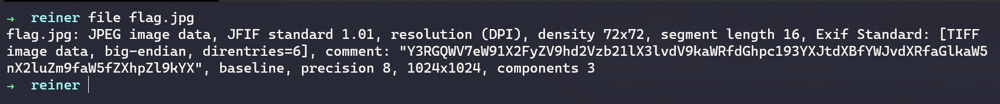
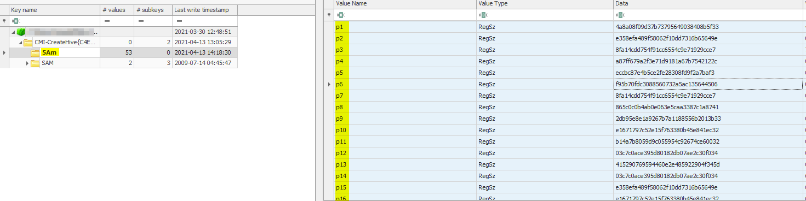

# Stage 1 - Digital Forensics
    
## L00K - Beginner:
Basic forensics challenge. We get a file called chall1.zip, download it and extract using `unzip` command:

 

Theres a file called *flag.\<b64>* and another file with a '.' prefix which means its a hidden file. We all know where the flag is hidden don't we? :) 

`cat .flag.ssd` reveals the flag in base64 so lets pipe it through `base64 -d`:


## Reiner - Easy:
Trickiness level is increasing. Now we get a jpg but this isn't Steg category its forensics right? Hit that image with `file`.



Hmm... thats an interesting comment. But when we `base64 -d` it we only get a partial result. We can get the full comment out by using `exiftool`.


And once we decode the comment we get:


## Super Password

The challenge provides us with a zip file and informs us the password is 45 bytes with uppercase, lowercase and numbers and special characters. Considering its just the zip file provided it would be unreasonable to expect someone to bruteforce 45 character passwords. There must be something else in here so lets use `binwalk` to get it out.


So turns out there is a jpeg attached to the end of this zip file. We can extract it with `binwalk flag.zip --dd='.*'` and that should give us a folder called *_flag.zip.extracted*.

Lets open up that image and have a look at our next clue. The image contains base64 so we can use any online OCR tool to extract the text.


After a lot of switching between I, L, O, and 0 characters in the text we figure out that the base64 is actually meant to be:
`aHR0cHM6Ly9tZWdhLm56L2ZpbGUvb0U5Rm5ZS1kjVmZlQjdlQzdzVkNTVE14ZUhxaTdfRHlOVWhVSG5TXzlmeXN2c0tIWHBOMA== ` which is a URL pointing to `https://mega.nz/file/oE9FnYKY#VfeB7eC7sVCSTMxeHqi7_DyNUhUHnS_9fysvsKHXpN0`

Now we get a file called *new_wordlist.txt.tar.gz* so that gives us a clue on our next step. Upon downloading it we can inspect the first few lines that there are a bunch of different possible passwords here. So we can filter them down with the rules specified in the challenge description (45 bytes, special characters etc...). But because I'm lazy I only filtered out those passwords that are atleast 45 chars using `strings -n 45 new_wordList.txt > wordlist.txt` and piped it to a new file.

Now I have a password file with only >=45 char passwords in it. Using the command `zip2john flag.zip > crackme.john` the encrypted zip has is converted to a format that is understood by JTR password cracker.

Now we can use a dictionary attack with `john flag.zip -w=newwordlist.txt` and we are in to the zip:
`uqHQKFPU%1_<=&MCD'\%4c8%LaiC>A/_9d)3&1!!U5oOs6-U`

We get another image which contains the flag:
*ctfae{welldone_you_know_how_to_crack_protected_file!!!}*

## L0oo091N

I spent way too long deep diving in to this because I didnt observe the obvious. We are provided with an *ad1* file which after a bit of googling tells us it can be opened with AccessData FTK. After downloading and installing the FTK we can import the image and we are presented with a Registry tree. The challenge description said there is something wrong with the passwords so we should be targetting the SAM entries in HKLM. At this point I didn't know that AccessData wasnt actually showing me the full registry I just thought it was intentionally corrupted for the purposes of the CTF and I branched off onto a DPAPI tangent. That was absolutely the wrong path to go down. I extracted the HKLM key (right click on the folder > export files) then opened that exported file with "Registry Explorer".

Suddenly we see the glaringly obvious:



There is another folder called 5Am and a bunch of MD5s in the registry! After verifying this is not hex I was certain its MD5 so after saving them all to a file we can hit it with JTR. `john passwords.txt --format=Raw-MD5`.

JTR output shows a string but its all jumbled up:


Theres probably a better way to do this but I just chucked all the hashes into a python script and generated a dictionary of all the different printable characters and their MD5 hashes. I then matched the hashes in the password with the hashes in the dictionary and got the flag:

```python
import hashlib
import string

hashchars = string.printable

hashed = {}
passwords = [
    "4a8a08f09d37b73795649038408b5f33",
    "e358efa489f58062f10dd7316b65649e",
    "8fa14cdd754f91cc6554c9e71929cce7",
    "a87ff679a2f3e71d9181a67b7542122c",
    "eccbc87e4b5ce2fe28308fd9f2a7baf3",
    "f95b70fdc3088560732a5ac135644506",
    "8fa14cdd754f91cc6554c9e71929cce7",
    "865c0c0b4ab0e063e5caa3387c1a8741",
    "2db95e8e1a9267b7a1188556b2013b33",
    "e1671797c52e15f763380b45e841ec32",
    "b14a7b8059d9c055954c92674ce60032",
    "03c7c0ace395d80182db07ae2c30f034",
    "415290769594460e2e485922904f345d",
    "03c7c0ace395d80182db07ae2c30f034",
    "e358efa489f58062f10dd7316b65649e",
    "e1671797c52e15f763380b45e841ec32",
    "6f8f57715090da2632453988d9a1501b",
    "b14a7b8059d9c055954c92674ce60032",
    "8fa14cdd754f91cc6554c9e71929cce7",
    "d95679752134a2d9eb61dbd7b91c4bcc",
    "4b43b0aee35624cd95b910189b3dc231",
    "e1671797c52e15f763380b45e841ec32",
    "7b8b965ad4bca0e41ab51de7b31363a1",
    "03c7c0ace395d80182db07ae2c30f034",
    "865c0c0b4ab0e063e5caa3387c1a8741",
    "4a8a08f09d37b73795649038408b5f33",
    "03c7c0ace395d80182db07ae2c30f034",
    "b14a7b8059d9c055954c92674ce60032",
    "865c0c0b4ab0e063e5caa3387c1a8741",
    "03c7c0ace395d80182db07ae2c30f034",
    "7b774effe4a349c6dd82ad4f4f21d34c",
    "8fa14cdd754f91cc6554c9e71929cce7",
    "b14a7b8059d9c055954c92674ce60032",
    "7b8b965ad4bca0e41ab51de7b31363a1",
    "7b8b965ad4bca0e41ab51de7b31363a1",
    "7b8b965ad4bca0e41ab51de7b31363a1",
    "518ed29525738cebdac49c49e60ea9d3",
    "01abfc750a0c942167651c40d088531d",
    "518ed29525738cebdac49c49e60ea9d3",
    "9033e0e305f247c0c3c80d0c7848c8b3",
    "c3e97dd6e97fb5125688c97f36720cbe",
    "b14a7b8059d9c055954c92674ce60032",
    "865c0c0b4ab0e063e5caa3387c1a8741",
    "03c7c0ace395d80182db07ae2c30f034",
    "7b8b965ad4bca0e41ab51de7b31363a1",
    "e358efa489f58062f10dd7316b65649e",
    "b14a7b8059d9c055954c92674ce60032",
    "865c0c0b4ab0e063e5caa3387c1a8741",
    "e358efa489f58062f10dd7316b65649e",
    "9033e0e305f247c0c3c80d0c7848c8b3",
    "9033e0e305f247c0c3c80d0c7848c8b3",
    "9033e0e305f247c0c3c80d0c7848c8b3",
    "cbb184dd8e05c9709e5dcaedaa0495cf"
]
for c in hashchars:
    hashed[c] = hashlib.md5(c.encode()).hexdigest()

flag = ''
for p in passwords:
    key = [k for k, v in hashed.items() if v == p]
    flag += key[0]

print(flag)
```

Flag: *ctf43{file_system_forensics_isuf_nnn@#@!$_isnt_it!!!}*

## Attack

Ok, I'll admit in this challenge I didn't follow the intended route at all. The challenge specifically mentioned DNS servers and even more specifically the authoritative DNS server. First instinct led me to DNS poisoning (which I believe was the case). However, instead of actually finding the DNS poisoning attacker etc I just thought to myself "all these domains are external and unless the organizers convinced the Wall Street Journal to upload their flag all we need to look for is http host == ramadan.ctf.ae". Opening it in Wireshark and using the filter `http.host == 'ramadan.ctf.ae'` makes things much easier to read and the link with the flag is obvious:


Following the link [https://ramadan.ctf.ae/wherethemagichappens21](https://ramadan.ctf.ae/wherethemagichappens21) we get to a page that provides the flag.

Flag: *CTFAE{congratulation_now_you_are_the_master_of_DNS_poisoning_detection_and_my_network_is_safe_with_you;)}*

## Regland

This challenge was very enjoyable, it involves thinking like an attacker and the answer is not in the most obvious place. The description mentions the registry specifically so we dont need to worry about all the additional stuff in that memory dump. Lets fire up volatility and see what kind of image we are working with: `vol.py imageinfo -f chall.vmem`

We have a few suggested profiles but I'm going to go with Win7x64SP1 blindly as thats a common OS to use. Initially I thought "lets find out what kind of process modified the registry, what ports are open, lets identify the malware". But all of that turned out to be pointless and completely unneccesary. The challenge is about the registry? First step, dump that registry! `vol.py dumpregistry -f chall.vmem`

After trying to open the hives with Registry Explorer nothing stood out but I could see from the output Registry Explorer wasn't handling these files well. Of all the hives only 2 actually managed to open properly. We can deduce that the hive with the User GUID would be the important one because it is contains registry information for a specific profile. Instead of using Registry Explorer we can open it with AccessData Registry Viewer.


Now we have our hive open we can think to ourselves what kind of information would an attacker change in the registry?

- Set program to run on startup
- Disable Task Manager
- Task Manager Preferences (to modify views and tabs)
- Other system preferences

When looking through the registry there is nothing to note in the startup folder. There is also nothing to note in the policies folder where you would disable task manager. However, when looking at Task Manager preferences we see:


Oh yeah, this is definitely the flag. This also means there is a much easier way to find the flag and that is just search for "flag" and go through the results. Indeed when we run `strings <registry file name> | grep -n "flag"` we get to see the line numbers in which the flag resides:


Once the name is known (flag1, flag2, etc...) if someone was to search one of those in the hive using Registry Viewer you would be taken immediately to the flag location.

Anyway, using volatility we can dump out the flag keys using `vol.py printkey -f .\chall.vmem --profile=Win7SP1x64 -K "Software\Microsoft\Windows NT\CurrentVersion\TaskManager" > flagoutput` use a text editor to leave behind just the base64 and then decode it into a new file. Use ` cat flagoutput| base64 -d > flag` to do that.

Now using the `file` command on our new flag file it tells us its a PNG which contains the flag:

Flag: *ctfae{great_jo6_yOu_c0mpleted_the_registry_Level}*

## Script

Another fantastic challenge. I really enjoyed this one particularly because I took the time to think about what I am working with before starting to script stuff. We get a compressed file which extracts an MP4. The MP4 is a bunch of flashing images and a line moving up and down the screen. Viewing the video information in VLC we can see the size and width is 256 x 256. Interesting, so if we wanted to represent data in this video we can do so in each frame quite easily. We can extract each frame of the video via `ffmpeg -i <filename> <dest-dir>/%03d.jpg`.

Now I have just realised that I managed to delete my script or atleast save it somewhere that I cannot find it so I will just talk through how I solved it as I have lots of challenges to cover so wont be recreating it just yet. Maybe once the full write up is complete then I will rewrite the script.

Anyway I tried to look for a pattern between the HSL and RGB of the frames but there was nothing there. The only thing left was the line. I figured the line only moves along the Y axis and the position of the line is probably the integer represenation of 1 bytes of data. I got the RGB value of the line but because of the image extraction it wasnt exactly pure black. Instead I decided to look at just the individual values of RGB and if any of them were 0 that would determine if we are looking at the line or not. 

Next step was to write a script to put it all in place, heres some python-esque pseudocode that basically covers all the areas (use opencv to get that pixel information it will make your life easier):

```python

data = b''
for image in directory:
    x = 10 # somewhere along the x axis of the frame
    for y in range (256) # height and width of frame:
        pixel = image(x,y) # get pixel from frame
        r, g, b = rgb(pixel) # get RGB values from pixel
         if r or g or b == 0: #If any of these values are 0 then we probably hit the Y value for the line 
             data += y # append it to our data

print(data) 
```

After all was said and done it output a JPG image which was not viewable to me but when I ran `strings` on the jpeg I got the flag.

Flag: *ctFAe{welcome_ya_great_scripting_master}*